```{r setup, include=FALSE}
knitr::opts_chunk$set(echo = FALSE)
```

This website only includes links to the reading and lecture content -- the
course assignments, recordings, and discussions are mapped out fully on the
Canvas homepage.

## Background Readings

Course notes are listed [here](notes.html). Source code and links to recorded
videos are listed at the top of each set of lecture notes.  While the notes are
required reading, the background texts below are not. We have included them here
in case you would like to read more deeply into topics introduced in the class.

| Week | Topic | Optional Reading |
| - | - | --- |
| 1 <br/> 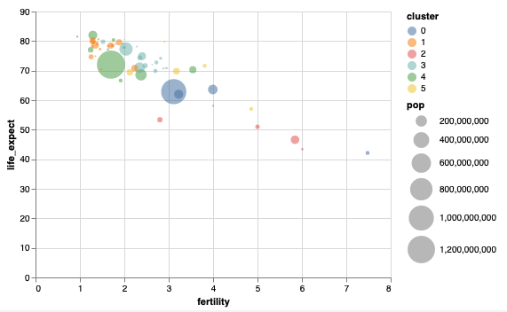 | Marks and Channels | (1) [Introduction to Data Science: Chapter 7](https://rafalab.github.io/dsbook/ggplot2.html) <br/> (2) [Fundamentals of Data Visualization: Chapters 2](https://rafalab.github.io/dsbook/ggplot2.html) <br/> (3) [Data Humanism](http://giorgialupi.com/data-humanism-my-manifesto-for-a-new-data-wold) |
| 2 <br/> 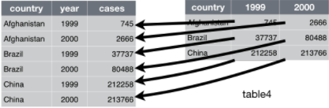 | Data Wrangling | (1) [R for Data Science: Chapter 12](https://r4ds.had.co.nz/tidy-data.html)<br/> (2) [Fundamentals of Data Visualization: Chapter 5](https://clauswilke.com/dataviz/directory-of-visualizations.html) |
| 3 <br/> 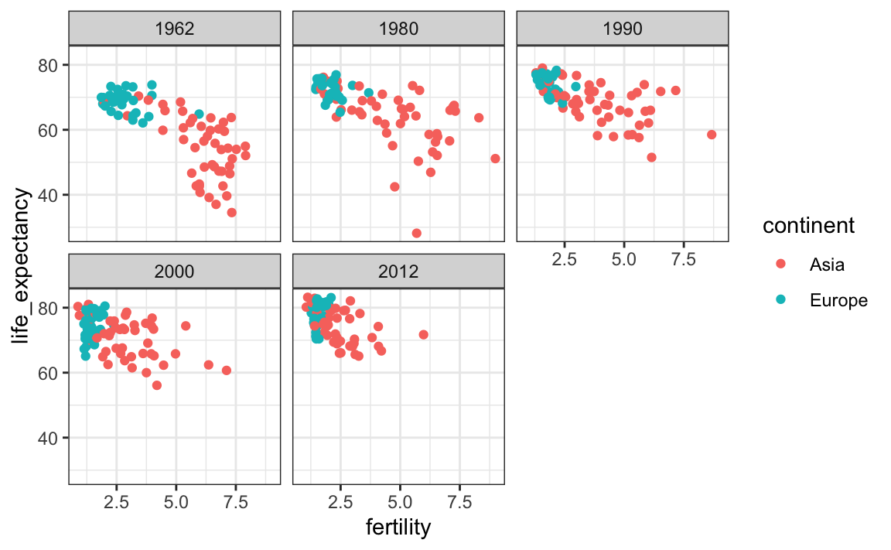 | Faceting and Layout | (1) [Fundamentals of Data Visualization: Chapter 21](https://clauswilke.com/dataviz/multi-panel-figures.html)<br/> (2) [Introduction to Data Science: Chapter 9.1 - 9.3, 9.7](https://rafalab.github.io/dsbook/gapminder.html) |
| 4 <br/> 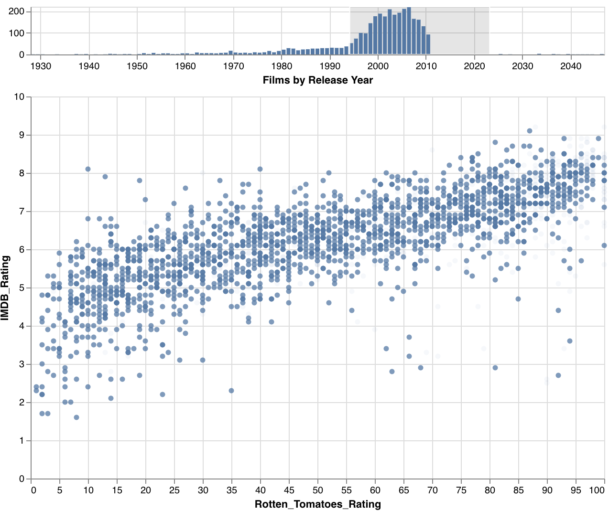 | Interaction I | (1) [Mastering Shiny: Chapters 3, 4](https://mastering-shiny.org/basic-reactivity.html) <br/> (2) [Visualization Analysis and Design: Chapter 12.1 - 12.3, 13.1 - 13.3](https://search.library.wisc.edu/catalog/9911196629502121) <br/> (3) [Up and Down the Ladder of Abstraction](http://worrydream.com/LadderOfAbstraction/) |
| 5 <br/> 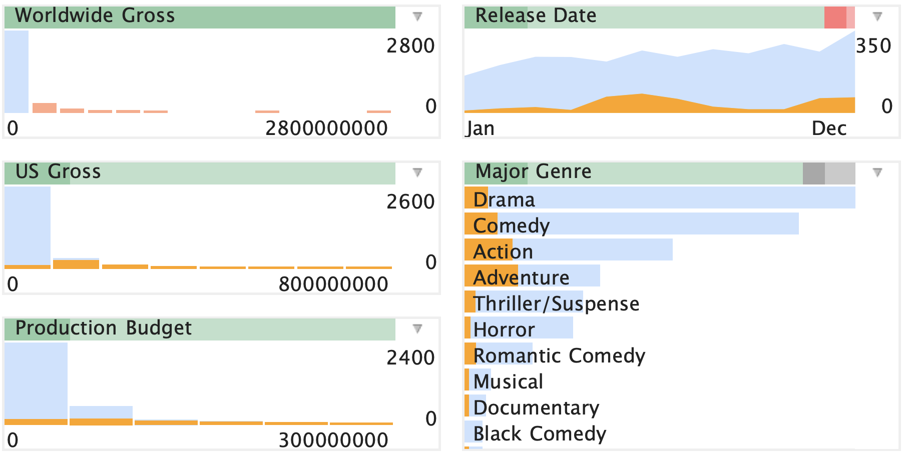 | Interaction II | (1) [Mastering Shiny: Chapter 7](https://mastering-shiny.org/action-graphics.html?q=time%20ser#action-graphics) <br/> (2) [Crosstalk tutorial](https://emilyriederer.github.io/demo-crosstalk/tutorial/tutorial-rmd.html) |
| 6 <br/> 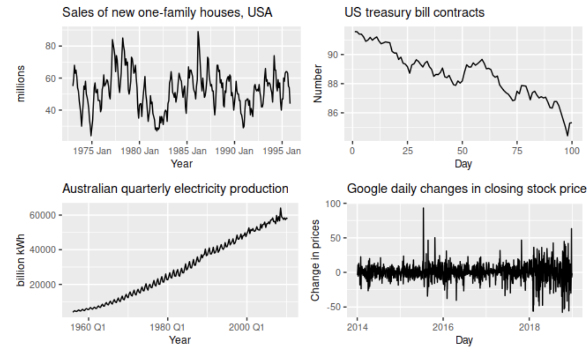 | Time Series | [Forecasting Principles and Practice: Chapter 2](https://otexts.com/fpp3/graphics.html) |
| 7 <br/> 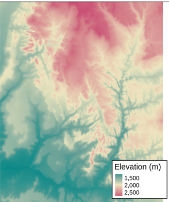 | Geographic Data | [Geographic Data in R: Chapter 2](https://geocompr.robinlovelace.net/spatial-class.html) |
| 8 <br/> 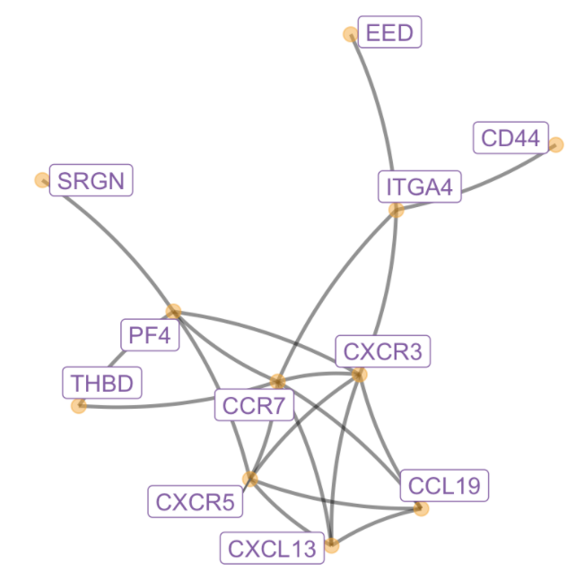| Network Data | (1) [Visualization Analysis and Design: Chapter 9](https://search.library.wisc.edu/catalog/9911196629502121) <br/> (2) [Modern Statistics for Modern Biology: Chapter 10.1 - 10.2](http://web.stanford.edu/class/bios221/book/Chap-Graphs.html)|
| 9 <br/> 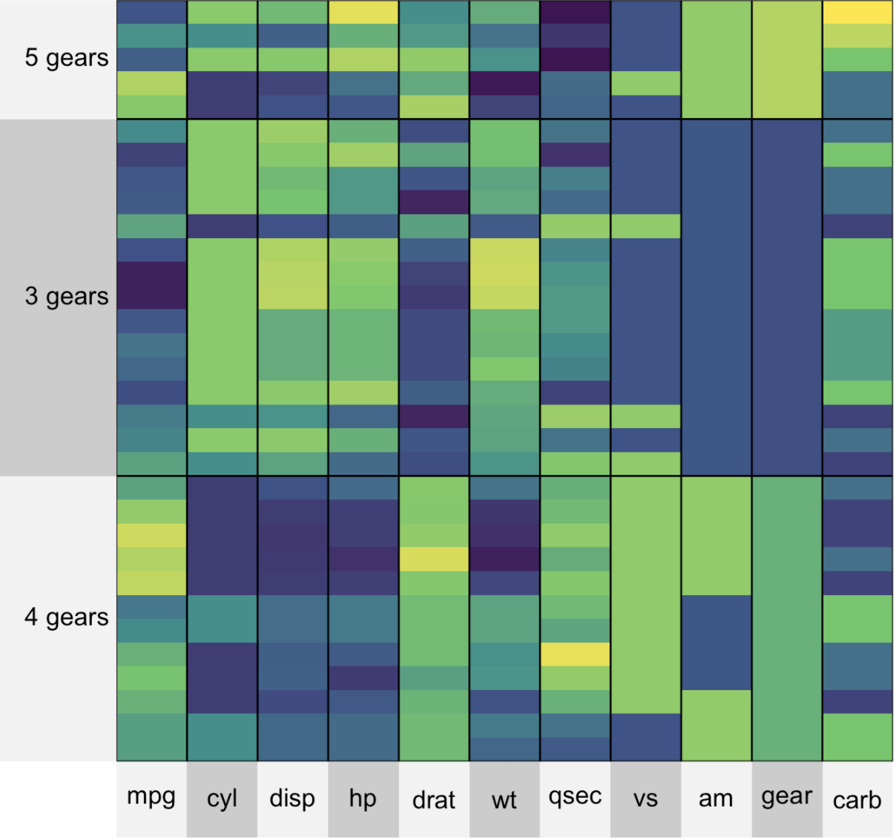 | Clustering | (1) [Intro to Data Science: Chapter 34](https://rafalab.github.io/dsbook/clustering.html)<br/> (2) [Superheat Vignette (2, 3 & 6)](https://rlbarter.github.io/superheat/basic-usage.html) <br/> (3) [Cluster Analysis of Genomic Data](http://users.umiacs.umd.edu/~hcorrada/CMSC702/readings/Solutions_ch13.pdf) |
| 10 <br/> 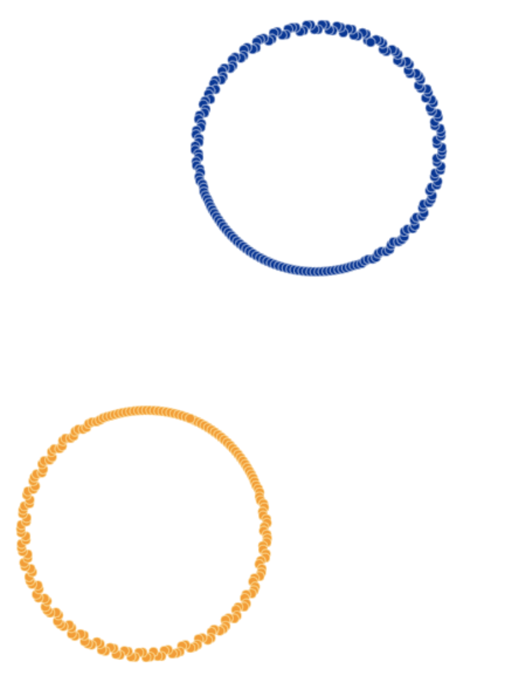| Dimensionality Reduction I | (1) [Beginner's Guide to Dimensionality Reduction](https://idyll.pub/post/visxai-dimensionality-reduction-1dbad0a67a092b007c526a45/)  <br/> (2) [PCA and UMAP with tidymodels and #TidyTuesday cocktail recipes](https://juliasilge.com/blog/cocktail-recipes-umap/) <br/> (3) [Understanding UMAP](https://pair-code.github.io/understanding-umap/) |
| 11 <br/> 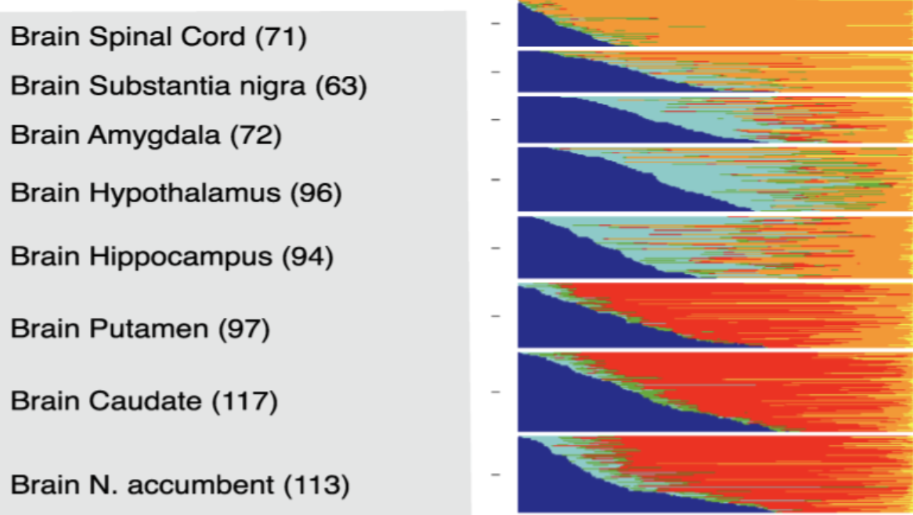| Dimensionality Reduction II | (1) [Text mining with R: Chapter 6](https://www.tidytextmining.com/topicmodeling.html) <br/> (2) [Visualizing the structure of RNA-seq expression data using grade of membership models](https://journals.plos.org/plosgenetics/article?id=10.1371/journal.pgen.1006599) |
| 12 <br/> 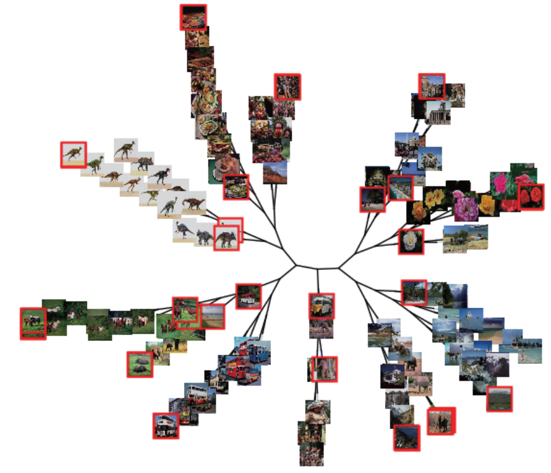| Model Building | (1) [Partial-dependence Profiles](http://ema.drwhy.ai/partialDependenceProfiles.html) <br/> (2) [Visualization in Bayesian workflow](https://arxiv.org/abs/1709.01449) |
| 13 <br/> | Deep Learning Models | (1) [Four Experiments in Handwriting with a Neural Network](https://distill.pub/2016/handwriting/) <br/> (2) [Visualizing what convnets learn](https://jjallaire.github.io/deep-learning-with-r-notebooks/notebooks/5.4-visualizing-what-convnets-learn.nb.html) <br/> (3) [Agency plus automation: Designing artificial intelligence into interactive systems](doi.org/10.1073/pnas.1807184115) |
| 14 <br/> | Conclusion | (1) [655 Frustrations of Doing Data Visualization](https://www.datasketch.es/project/655-frustrations-doing-data-visualization) <br/> (2) [Tukey, Design Thinking, and Better Questions](https://simplystatistics.org/2019/04/17/tukey-design-thinking-and-better-questions/) <br/> (3) [A Brief History of Data Visualization](https://datavis.ca/papers/hbook.pdf) |
